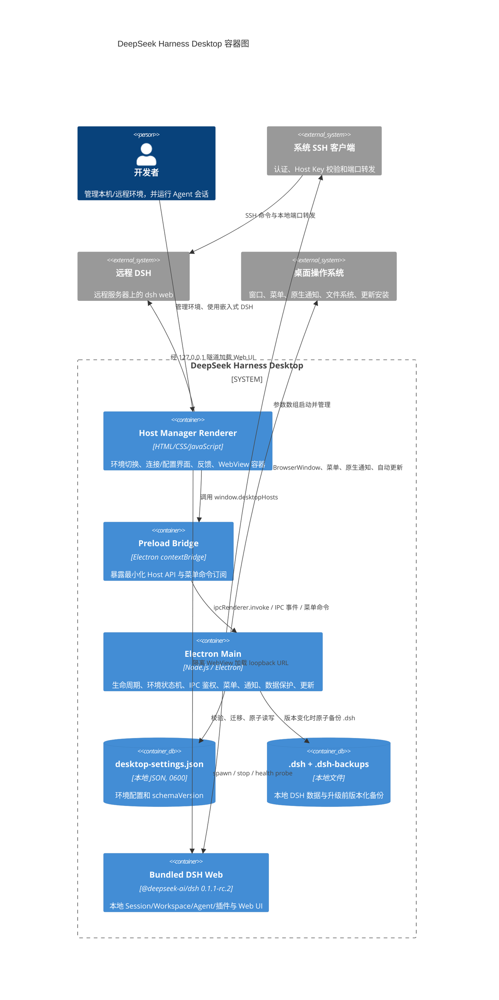
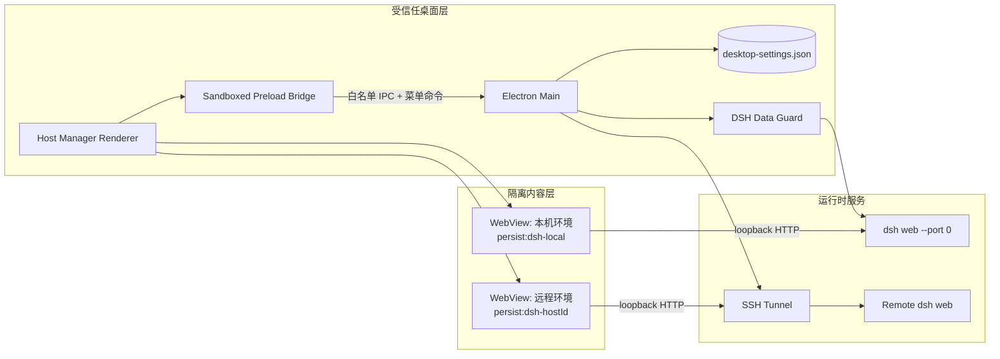
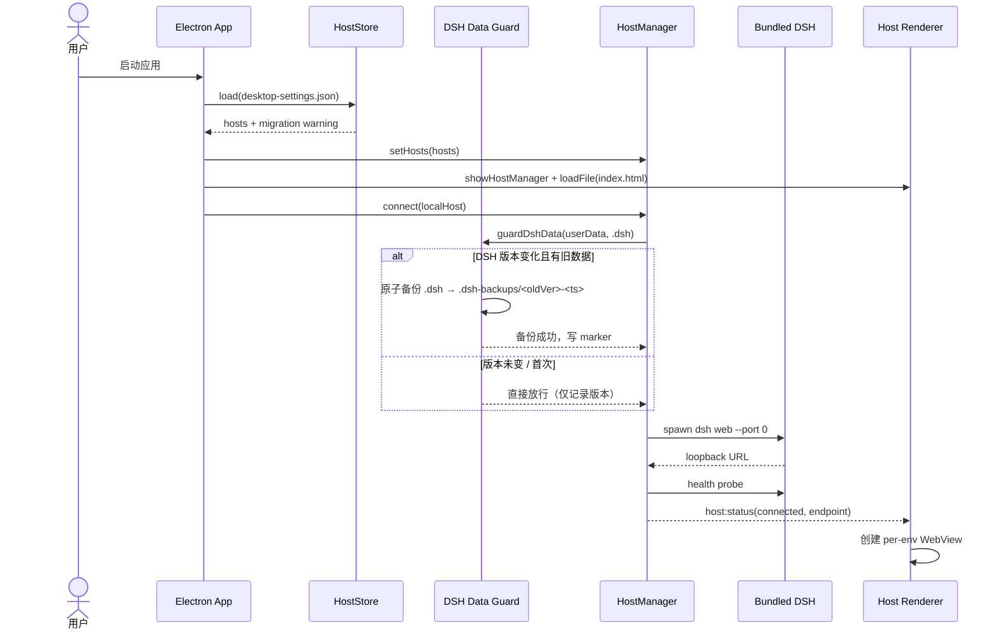
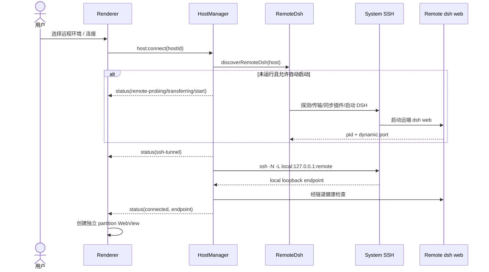
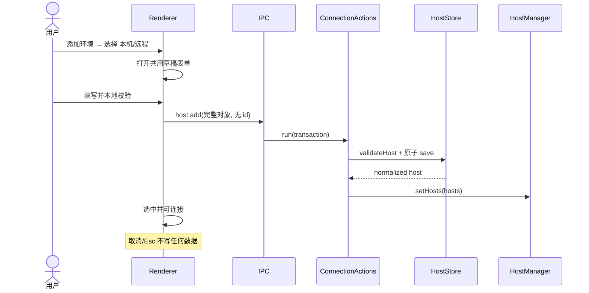
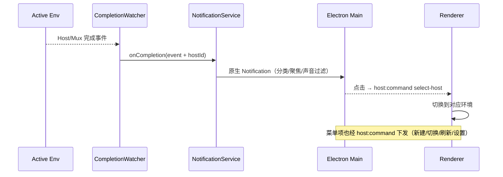
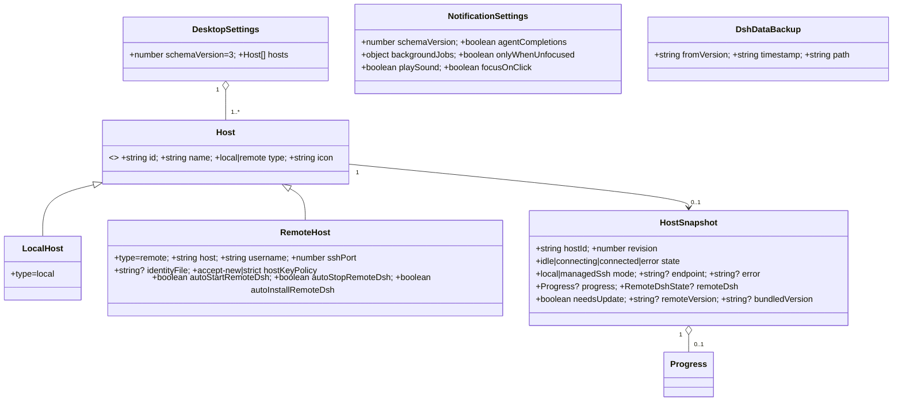

# DeepSeek Harness Desktop 架构说明

> 本文基于 2026-08-25 的代码快照整理，聚焦桌面壳、环境（Host）管理、本地/远程连接、嵌入式 DSH Web、通知、数据升级保护与本地持久化。`@deepseek-ai/dsh` 内部插件实现属于外部依赖（当前 `0.1.1-rc.2`），不在本仓库的代码边界内。

## 1. 架构概览

DeepSeek Harness Desktop 是一个 **Electron 桌面控制面（control plane）+ DSH Web 数据面（data plane）** 的组合：

- Electron 主进程负责 环境配置、进程/SSH 生命周期、健康检查、系统通知、菜单与快捷键、自动更新、DSH 升级前数据备份与安全边界。
- 本仓库自带的 Host Manager Renderer 负责多环境切换、连接状态、配置、反馈与 WebView 容器。
- 真正的会话、Workspace、Agent、模型与插件体验由每个环境上的 `dsh web` 提供，并嵌入到隔离的 `<webview>` 中。
- 本地环境由桌面应用拉起随包分发的 DSH；远程环境通过系统 SSH 管理远端 DSH、建立本地转发后再加载 Web UI。

产品心智模型统一为三层：

1. **环境（Environment）**：Agent 在哪里运行（本机 / 远程），代码模型仍称 `Host`。
2. **工作区（Workspace）**：Agent 操作哪份代码，由嵌入式 DSH 管理。
3. **会话（Session）**：用户正在完成的任务，由嵌入式 DSH 管理。

### 1.1 C4 Container 图

### 1.2 进程与信任边界

安全特征：`nodeIntegration:false`、`contextIsolation:true`、`sandbox:true`；Preload 仅暴露 `desktopHosts` 白名单方法（含只读 `onCommand`）；IPC 校验发送窗口、主 frame 和 URL；每个环境独立持久化 partition；禁止外部窗口/主框架导航；SSH 认证委托系统 SSH，不保存密码或私钥口令；原生通知只在主进程创建。

## 2. 代码组织与模块职责

### 2.1 主进程

| 模块 | 职责 | 公开接口/事件 |
|---|---|---|
| `src/main.js` | Composition Root；初始化 Store、Window、HostManager、通知、语言、菜单、数据保护与退出清理 | `initialize()`、`buildMenu()`、`syncIntegrations()` |
| `src/main/windows.js` | Host Manager 主窗口、安全 WebPreferences、标题栏、菜单命令下发 `host:command`、通知设置窗口 | `createWindowManager()`、`showHostManager()`、`sendCommand()`、`showNotificationSettings()` |
| `src/main/host-manager.js` | 环境连接状态机；连接/断开、本地/远程、健康监测、版本检查与更新 | `connect()`、`disconnect()`、`getSnapshot()`、`updateRemoteDsh()`；`status` 事件 |
| `src/main/host-store.js` | 环境配置模型、校验、v2→v3 迁移与原子持久化 | `createHostStore()`、`validateHost()`、`validateSettings()` |
| `src/main/dsh-data-guard.js` | 本地 DSH 版本切换前对 `.dsh` 做一次性原子备份，失败阻止启动 | `guardDshData()` |
| `src/main/ipc.js` | Renderer→Main 的 IPC 白名单、鉴权与串行事务 | `registerHostIpc()` |
| `src/main/connection-actions.js` | 将修改连接/配置的异步操作串行化 | `run()`、`idle()` |
| `src/main/local-dsh.js` / `managed-ssh.js` / `remote-dsh.js` | 本地进程启动 / SSH 隧道 / 远端发现·安装·启动·停止·更新 | 各生命周期函数 |
| `src/main/dsh-health.js` / `dsh-api-client.js` | DSH loopback 健康探测 / API 调用 | `waitForDsh()`、`probeDsh()`、`callDsh()` |
| `src/main/completion-watcher.js` | 订阅 Host/Mux 事件，基线化并发完成通知 | `CompletionWatcher` |
| `src/main/notification-service.js` / `notification-settings-store.js` / `notification-ipc.js` | 原生任务完成通知、设置存储与 IPC | `NotificationService`、`createNotificationSettingsStore()`、`registerNotificationIpc()` |
| `src/main/locale-service.js` / `i18n.js` | 跟随 DSH/system 语言并刷新菜单与通知文案 | `LocaleService`、`translate()` |
| `src/main/auto-updater.js` | 打包版本 GitHub 自动更新 | `initAutoUpdater()` |

### 2.2 Renderer 与桥接

| 模块 | 职责 |
|---|---|
| `src/preload/host-manager.js` | 暴露 Host API、窗口控制、状态订阅、菜单命令订阅 `onCommand` |
| `src/preload/notification-settings.js` | 通知设置窗口的受限 API |
| `src/renderer/host-manager/index.html` / `index.css` / `index.js` | 环境切换栏、显式操作区、反馈 toast/banner、共用新增/编辑表单、ARIA 与键盘、视觉系统 |
| `src/renderer/host-manager/i18n.js` | Renderer 侧 zh/en 字典，按 `navigator.language` 回退 |
| `src/renderer/host-manager/webview-lifecycle.js` | 纯逻辑 WebView LRU 生命周期控制器（none/active/hidden/evicted/crashed） |
| `src/renderer/notification-settings/*` | 通知设置界面 |

### 2.3 Renderer → Main 接口

- 查询/选择：`host:get-state`、`host:set-active`
- 配置 CRUD：`host:add`、`host:update`、`host:delete`
- 连接：`host:connect`、`host:disconnect`
- 远程运维：`host:remote-dsh-restart|stop|version|log|process-details|config|update`
- 推送：`host:status`、`host:refresh`、`host:command`（菜单命令：`new-environment`/`environment-settings`/`dsh-settings`/`reconnect`/`previous-environment`/`next-environment`/`refresh-webview`/`select-host`）
- 窗口：`window:minimize|maximize|close`、`window:state`
- 通知：设置读写/测试/打开系统设置

## 3. 关键调用关系

### 3.1 启动、数据保护与本地环境自动连接

若备份失败，`guardDshData` 抛错并阻止本地 DSH 启动，marker 不写，下次启动重试，避免破坏旧数据。

### 3.2 远程环境连接

### 3.3 新增/编辑环境（修复后的流程）

### 3.4 完成通知与菜单命令

## 4. 数据模型快照

### 存储位置

| 数据 | 位置 | 所有者/生命周期 |
|---|---|---|
| 环境配置 | `<userData>/desktop-settings.json` | HostStore；0600、临时文件+rename |
| 本地 DSH 数据 | `<userData>/.dsh` | 本地 DSH |
| DSH 升级备份 | `<userData>/.dsh-backups/<oldVer>-<ts>` | DSH Data Guard；版本变化时一次性 |
| 通知设置 | `<userData>` 下 JSON | NotificationSettingsStore |
| Web 会话/cookie | `persist:dsh-<hostId>` partition | Electron Session；环境间隔离 |
| 远程 DSH 数据 | 远程主机 | 远程 DSH |

## 5. 前端与交互约束

- 环境切换栏显示图标/名称/类型/状态文字（不只用颜色）与更新提示；当前环境提供显式 连接/断开/重试/编辑/更多 操作，右键菜单仅作加速。
- 所有操作有 busy/success/error 反馈（aria-live toast/banner），不再只 console.error；危险操作用应用内确认对话框。
- 完整键盘/ARIA：tablist roving tabindex + 方向键/Home/End、`Cmd/Ctrl+1~9`、`Ctrl(+Shift)+Tab`、`role=menu` 菜单、对话框焦点与 Esc；图标按钮均有可访问名称。
- 视觉：中性灰主体 + DeepSeek blue（信息/焦点），状态色专用；light/dark/system、`focus-visible`、`prefers-reduced-motion`、`forced-colors`。
- WebView：per-env persistent partition、did-fail-load/crashed/render-process-gone/unresponsive 的恢复态与重载；`webview-lifecycle.js` 提供 LRU 治理策略。

## 6. 构建与验证

- 本地 DSH 与远程 bundle 使用同一 DSH 版本（当前 `0.1.1-rc.2`）；远程 bundle 仅在 Linux x64 glibc 构建（`dsh-bundle.tar.gz` + `dsh-bundle.manifest.json` + `dsh-bundle.version`）。
- `npm run check` = 语法检查 + 打包文件清单校验（`scripts/verify-packaged-files.mjs`）+ `node:test`（含 host-store/host-manager/remote-dsh/notification/dsh-data-guard/webview-lifecycle/UI a11y）。
- CI（`.github/workflows/build-macos.yml`）：Linux 构建 bundle → macOS x64/arm64 打包、架构校验、packaged smoke、签名/公证（有凭据时）。

## 7. 关键源文件索引

- Composition Root：`src/main.js`
- 环境状态机：`src/main/host-manager.js`；配置模型：`src/main/host-store.js`
- 数据保护：`src/main/dsh-data-guard.js`
- IPC / Preload：`src/main/ipc.js`、`src/preload/host-manager.js`
- 连接：`src/main/local-dsh.js`、`managed-ssh.js`、`remote-dsh.js`
- 通知：`src/main/notification-*.js`、`src/renderer/notification-settings/*`
- 桌面壳界面：`src/renderer/host-manager/{index.html,index.css,index.js,i18n.js,webview-lifecycle.js}`
- 外部产品面：`@deepseek-ai/dsh`（npm 依赖，运行时 Web UI）
